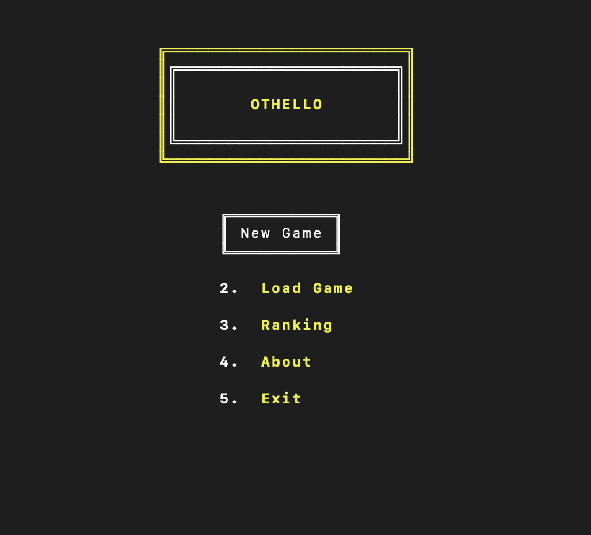
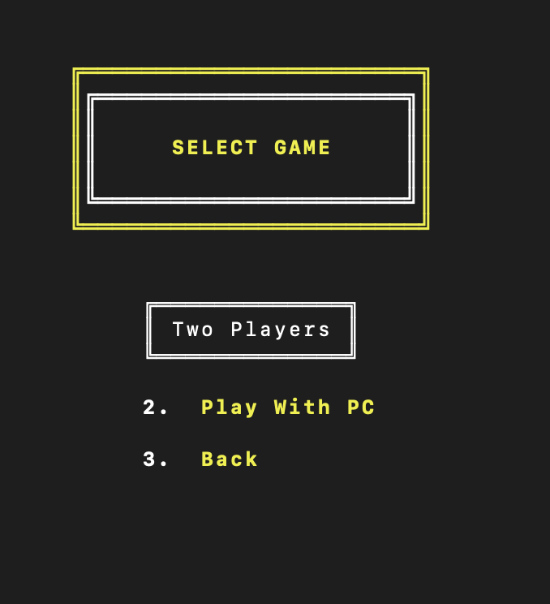
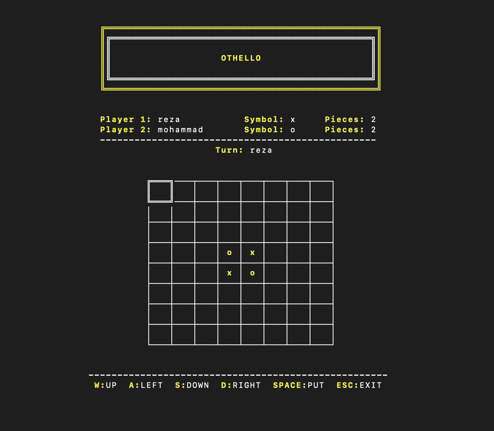
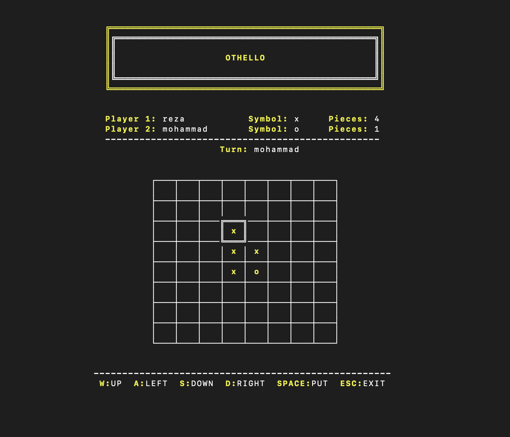
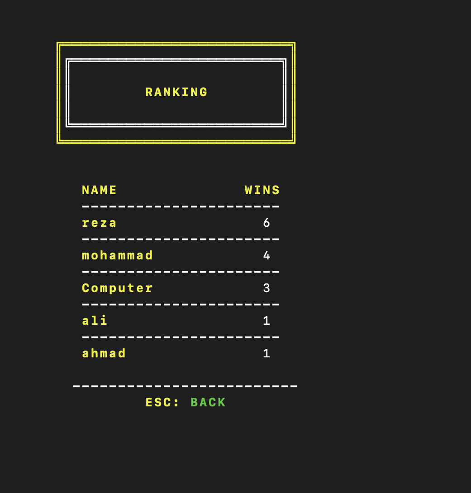
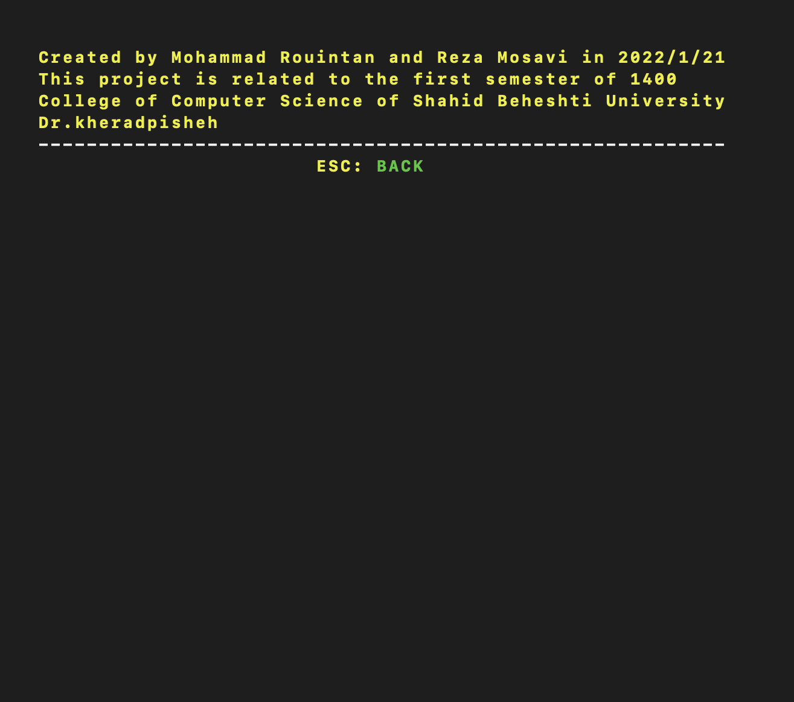
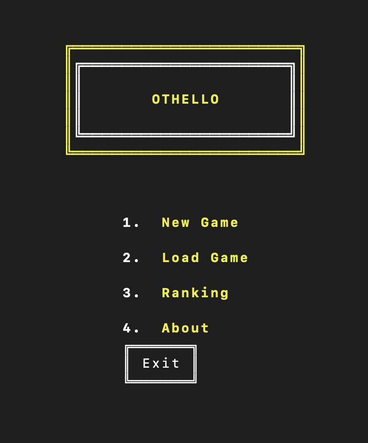

# OTHELLO

<p align="center">
  
</p>

Othello, also known as Reversi, is a classic two-player board game played on an 8x8 grid. The objective is to have more of your colored discs on the board than your opponent by the end of the game. Players take turns placing their discs on the board, capturing the opponent's discs by sandwiching them between their own discs. Captured discs are flipped to the capturing player's color. The game ends when the board is full or when both players cannot make any more valid moves. The player with the most discs of their color on the board at the end of the game is declared the winner. Othello is a strategic and engaging game that is easy to learn but offers depth and challenge for players of all levels.

## Developers

- [**Reza Mosavi**](https://github.com/rezamosavi8740)
- [**Mohammad Rouintan**](https://github.com/MohammadRouintan)

### General description of the game

Othello, also known as Reversi, is a classic two-player board game that is played on an 8x8 grid. The game is named after Shakespeare's tragedy "Othello," but the gameplay has no relation to the play's story.

Objective:
The objective of Othello is to have more of your own colored discs on the board than your opponent does by the end of the game. The game ends when the board is full or when neither player can make any more valid moves.

Setup:
The game board consists of 64 squares, each of which can hold a colored disc. At the start of the game, four discs are placed in the center of the board: two of one color (usually dark) and two of the other (usually light). This forms the initial setup for Othello.

Gameplay:
Players take turns making their moves. The dark player goes first. On their turn, a player must place one of their discs on the board in such a way that it captures at least one of the opponent's discs. To capture an opponent's disc, the player must place their disc in a position that sandwiches one or more of the opponent's discs between two of their own discs, either horizontally, vertically, or diagonally. All the sandwiched discs are then flipped to the capturing player's color.

For example:
Let's say the board looks like this (D for dark, L for light, and E for empty):
```
E E E E E E E E
E E E E E E E E
E E E E E E E E
E E E D L E E E
E E E L D E E E
E E E E E E E E
E E E E E E E E
E E E E E E E E
```
If the dark player places their disc in the lower-left corner, it will capture the light disc in the second row, second column, and flip it to dark. The resulting board will be:
```
E E E E E E E E
E E E E E E E E
E E E E E E E E
E E E D L E E E
E E E D D E E E
E E E E E E E E
E E E E E E E E
E E E E E E E E
```

If a player cannot make any valid moves, they pass their turn, and the other player continues. If both players are unable to move, the game ends.

End of the game:
The game is over when the board is full, and no more moves can be made, or when both players consecutively pass their turns. At this point, the player with the most discs of their color on the board is declared the winner.

Othello is a strategic game that requires players to plan ahead and think strategically to control as much of the board as possible. It's easy to learn, yet challenging to master, making it a favorite for players of all ages and skill levels.

    
# OTHELLO Game

This program is written in C++ language. Due to the limitations of the lesson, we had to implement the user interface in the terminal.
 -  _Menu_
<p align="center">
  
</p>


 -  _New Game_
<p align="center">
  
</p>

 -  _Game Table_
<p align="center">
  
</p>

-  _Gamepaly_
<p align="center">
  
</p>


-  _Load_
<p align="center">
  
</p>

-  _Ranking_
<p align="center">
  
</p>

-  _About_
<p align="center">
  
</p>

-  _Exit_
<p align="center">
  
</p>


